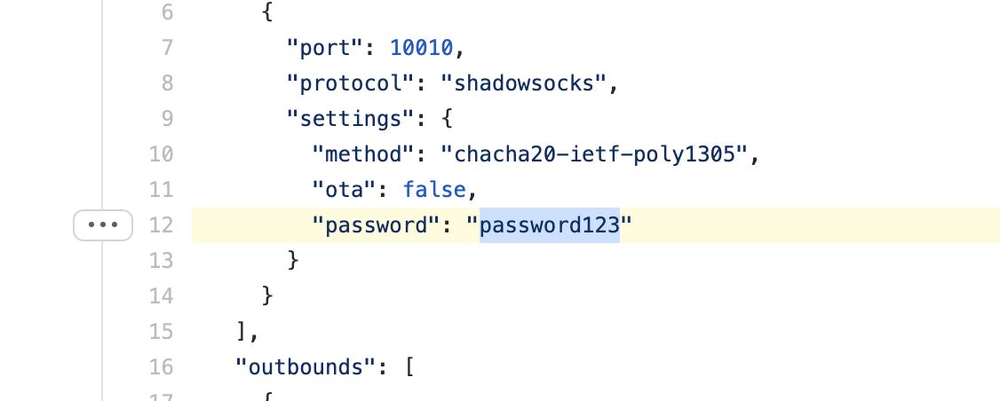
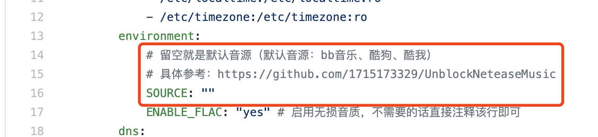

# UnblockNeteaseMusic-Node XRay

## 简介

* XRay作为服务端，使用Shadowsocks协议进行通讯
* 本项目中使用的UnblockNeteaseMusic-Node来自[Tianling Shen](https://github.com/1715173329/UnblockNeteaseMusic)，感谢作者以及为它贡献的所有Coder，同时感谢Node版本的原作者[nondanee](https://github.com/nondanee/UnblockNeteaseMusic)
* 默认开启无损解锁


## 关于证书

本项目所使用的证书来自[Tianling Shen](https://github.com/1715173329/UnblockNeteaseMusic)，使用这个证书的目的是为了提供更好的兼容性，因为较多的项目中都使用的这个证书，如果不相信作者，可以自己使用cert里面的[generate-cert.sh](https://github.com/maidoudouo/UnblockNeteaseMusicNode_XRay_Docker/blob/main/cert/generate-cert.sh)自行生成证书。然后将ca.crt下载到自己的设备中安装即可（**苹果全家桶**必须要安装才能使用）


## 使用方式

### 1、安装Docker

#### CentOS

```
# 获取官方源
wget -P /etc/yum.repos.d/ https://download.docker.com/linux/centos/docker-ce.repo

# 安装docker ce
yum install -y docker-ce

# 启动、开机启动
systemctl start docker
systemctl enable docker
```

当然如果你想指定版本安装docker也是可以的

```
# 用下面的命令可以查看可以安装的版本
yum list docker-ce --showduplicates | sort -r
# 安装指定版本的Docker
yum install -y docker-ce-18.03.0.ce-1.el7.centos
```

#### Ubuntu

```
sudo apt-get update
sudo apt-get install docker.io
```


### 2、安装Docker Compose（容器编排工具）

```
sudo curl -L https://github.com/docker/compose/releases/download/1.29.2/docker-compose-$(uname -s)-$(uname -m) -o /usr/local/bin/docker-compose
sudo chmod +x /usr/local/bin/docker-compose
docker-compose --version
```

### 3、设置

①修改[Shadowsocks密码](https://github.com/maidoudouo/UnblockNeteaseMusicNode_XRay_Docker/blob/4e378d7f2f7e9c6bf7567480fcfabf78c4344f84/xray/config.json#L12)

进入xray/config.json，修改图中位置的密码



②[修改音源](https://github.com/maidoudouo/UnblockNeteaseMusicNode_XRay_Docker/blob/4e378d7f2f7e9c6bf7567480fcfabf78c4344f84/docker-compose.yml#L16)（此步非必须，其实保持默认即可）

具体设置参考[UnblockNeteaseMusicNode](https://github.com/nondanee/UnblockNeteaseMusic)



### 构建

```shell
./build.sh
```


## 其他问题

如果你遇到了问题，一般不是由本项目造成的，请参考UnblockNeteaseMusicNode修改版项目的[Issues](https://github.com/1715173329/UnblockNeteaseMusic/issues)和原版作者的[Issues](https://github.com/nondanee/UnblockNeteaseMusic/issues)


## 声明

该项目只能用作学习，请自行开通会员以支持平台购买更多的版权